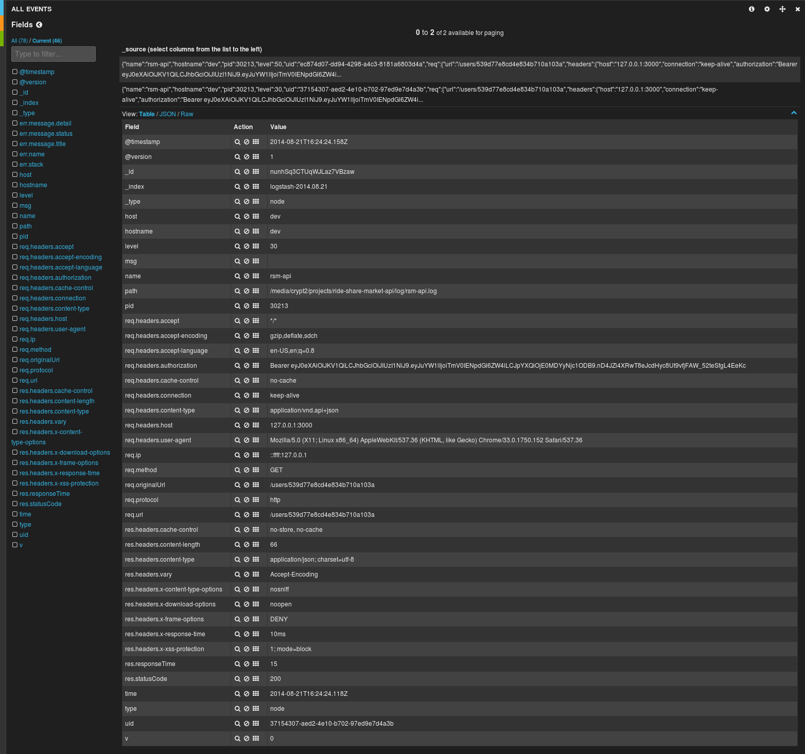
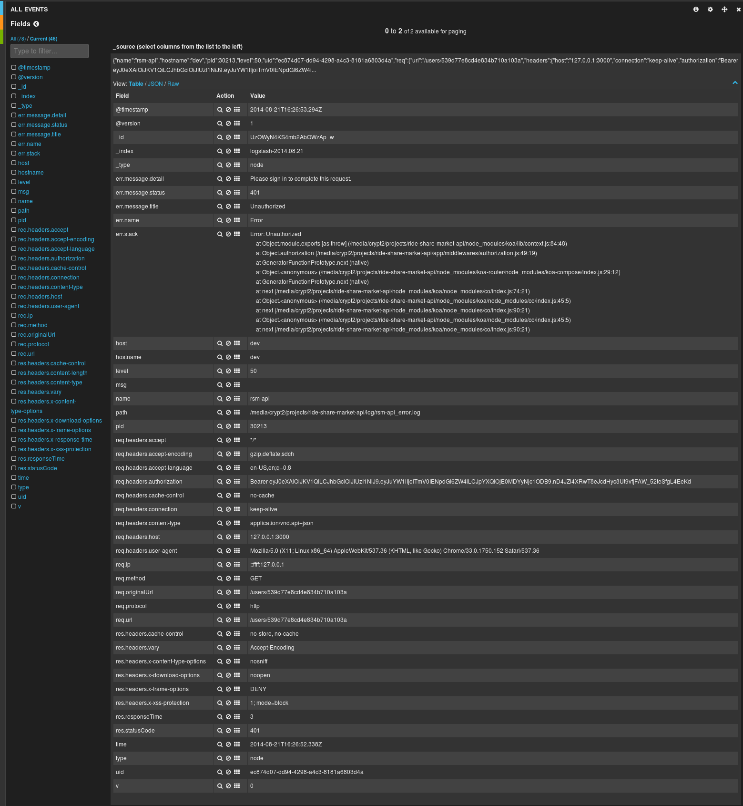

koa-json-logger
===============

KoaJS HTTP Request/Response and Request/Response/Error JSON format logger.

  
  
  
  

The actual logging is done with [node-bunyan](https://github.com/trentm/node-bunyan)

Credits and inspired by:

* [KoaJS](https://github.com/koajs)
* [express-winston](https://github.com/heapsource/express-winston)
* [node-bunyan](https://github.com/trentm/node-bunyan)
* [koa-bunyan](https://github.com/ivpusic/koa-bunyan)
* [KoaJS Logger](https://github.com/koajs/logger)

Code review, suggestions and pull requests very much welcome - thanks!

## Overview

The basic goal of this module is to create log entries in JSON format for each HTTP request.

Success (<400) log entries will contain Request and Response details.

Error (>=400) log entries will contain Request, Response and Error details.

Success and Error logs will have their own file (two files).

In the node env of development errors will also be output to the console.

500 error responses are logged in full detail but the HTTP user response will always be only 'Internal Server Error'.

Less than 500 and greater than 500 error responses are logged and passed through as is to the user in the HTTP response.

Higher level goals are:

- Create uniform success and error log entries in JSON format for centralized logging
- In particular tested and used with the ELK stack (Logstash, Elasticsearch and Kibana)
- A unique ID (RFC4122 uuid v4) is also created for each log entry.
- This uid can be used in other application logs, which end up in ELK, so you can correlate the request or error with other application log entries.

Below will be some sample log entries in pretty print and also some screen shots of how they look in Kibana.

## Install

`npm install koa-json-logger`

## Usage

`var koaJsonLogger = require('koa-json-logger');`

`app.use(koaJsonLogger());`

I suggest it's best to use this middleware high in the middleware stack so any and all downstream uncaught errors are logged.

Logs will go into a `log/` directory relative to file that instruments the Koa app, so you'll need to create this folder.
 
Default use will create two log files:

`log/myapp.log` will contain req/res log entries.

`log/myapp_error.log` will contain error log entries.

Log files have daily rotation and keeps 3 back copies.

Currently the only supported config options are:

- `name` which configures the log file name and name property of the log entry.

- `path` which configures the log directory (relative) to use.

Example:

      app.use(koaJsonLogger({
        name: 'myCoolApp',
        path: 'logs'
      }));

When you throw an application error it's best to always use [throw](https://github.com/koajs/koa/blob/master/docs/api/context.md#ctxthrowmsg-status-properties)

Example:

    `this.throw(403, 'Access Denied');`

See the docs for more details [throw](https://github.com/koajs/koa/blob/master/docs/api/context.md#ctxthrowmsg-status-properties)

You can return errors this way (no throw) but they will be silently *not* logged - so best *not* to do it this way:

    // Not a good way to an return error
    this.status = 401;
    this.body = 'Access Denied';

The uid is set for each request and can be accessed/used with `this.uuid`

For example using Bunyan elsewhere in your application for logging you could use the uid like so:

`logger.info({uid: this.uuid}, 'Application log message here');`

Then you can correlate http request/response/error log entries with you application log entries based on the uid.

Please review the test suite for further details.

## Tests with code coverage report in `test/coverage`

Note: Requires nodes at least v0.11.13 (earlier v0.11 versions may work, have not checked for this).

git clone the full repo: `git clone git@github.com:rudijs/koa-json-logger.git`

`cd koa-json-logger`

`npm install`

`npm test`

## Code Linting

`./node_modules/jshint/bin/jshint lib/**/*.js`

`./node_modules/jshint/bin/jshint test/*.js`

## Sample Success Log Entry (pretty print)

	{
	   "name":"rsm-api",
	   "hostname":"dev",
	   "pid":30213,
	   "level":30,
	   "uid":"37154307-aed2-4e10-b702-97ed9e7d4a3b",
	   "req":{
	      "url":"/users/539d77e8cd4e834b710a103a",
	      "headers":{
		 "host":"127.0.0.1:3000",
		 "connection":"keep-alive",
		 "cache-control":"no-cache",
		 "user-agent":"Mozilla/5.0 (X11; Linux x86_64) AppleWebKit/537.36 (KHTML, like Gecko) Chrome/33.0.1750.152 Safari/537.36",
		 "content-type":"application/vnd.api+json",
		 "accept":"*/*",
		 "accept-encoding":"gzip,deflate,sdch",
		 "accept-language":"en-US,en;q=0.8"
	      },
	      "method":"GET",
	      "ip":"::ffff:127.0.0.1",
	      "protocol":"http",
	      "originalUrl":"/users/539d77e8cd4e834b710a103a",
	      "query":{}
	   },
	   "res":{
	      "statusCode":200,
	      "responseTime":15,
	      "headers":{
		 "cache-control":"no-store, no-cache",
		 "x-content-type-options":"nosniff",
		 "x-download-options":"noopen",
		 "x-xss-protection":"1; mode=block",
		 "x-frame-options":"DENY",
		 "vary":"Accept-Encoding",
		 "content-type":"application/json; charset=utf-8",
		 "x-response-time":"10ms",
		 "content-length":"66"
	      }
	   },
	   "msg":"",
	   "time":"2014-08-21T16:24:24.118Z",
	   "v":0
	}

## Sample Error Log Entry (pretty print)

	{
	   "name":"rsm-api",
	   "hostname":"dev",
	   "pid":30213,
	   "level":50,
	   "uid":"ec874d07-dd94-4298-a4c3-8181a6803d4a",
	   "req":{
	      "url":"/users/539d77e8cd4e834b710a103a",
	      "headers":{
		 "host":"127.0.0.1:3000",
		 "connection":"keep-alive",
		 "cache-control":"no-cache",
		 "user-agent":"Mozilla/5.0 (X11; Linux x86_64) AppleWebKit/537.36 (KHTML, like Gecko) Chrome/33.0.1750.152 Safari/537.36",
		 "content-type":"application/vnd.api+json",
		 "accept":"*/*",
		 "accept-encoding":"gzip,deflate,sdch",
		 "accept-language":"en-US,en;q=0.8"
	      },
	      "method":"GET",
	      "ip":"::ffff:127.0.0.1",
	      "protocol":"http",
	      "originalUrl":"/users/539d77e8cd4e834b710a103a",
	      "query":{}
	   },
	   "res":{
	      "statusCode":401,
	      "responseTime":3,
	      "headers":{
		 "cache-control":"no-store, no-cache",
		 "x-content-type-options":"nosniff",
		 "x-download-options":"noopen",
		 "x-xss-protection":"1; mode=block",
		 "x-frame-options":"DENY",
		 "vary":"Accept-Encoding"
	      }
	   },
	   "err":{
	      "message":{
		 "status":401,
		 "title":"Unauthorized",
		 "detail":"Please sign in to complete this request."
	      },
	      "name":"Error",
	      "stack":"Error: Unauthorized\n    at Object.module.exports [as throw] (/media/crypt2/projects/ride-share-market-api/node_modules/koa/lib/context.js:84:48)\n    at Object.authorization (/media/crypt2/projects/ride-share-market-api/app/middlewares/authorization.js:49:19)\n    at GeneratorFunctionPrototype.next (native)\n    at Object.<anonymous> (/media/crypt2/projects/ride-share-market-api/node_modules/koa-router/node_modules/koa-compose/index.js:29:12)\n    at GeneratorFunctionPrototype.next (native)\n    at next (/media/crypt2/projects/ride-share-market-api/node_modules/koa/node_modules/co/index.js:74:21)\n    at Object.<anonymous> (/media/crypt2/projects/ride-share-market-api/node_modules/koa/node_modules/co/index.js:45:5)\n    at next (/media/crypt2/projects/ride-share-market-api/node_modules/koa/node_modules/co/index.js:90:21)\n    at Object.<anonymous> (/media/crypt2/projects/ride-share-market-api/node_modules/koa/node_modules/co/index.js:45:5)\n    at next (/media/crypt2/projects/ride-share-market-api/node_modules/koa/node_modules/co/index.js:90:21)"
	   },
	   "msg":"",
	   "time":"2014-08-21T16:26:52.338Z",
	   "v":0
	}

## Kibana Success Screenshot example:

## Kibana Error Screenshot example:

